# 📊RoriPlatform: Modern Workforce Management

## 📌 Description
* This project is a **comprehensive HR ecosystem** designed to provide companies with advanced tools for **workforce administration, contract lifecycle management, and internal task coordination**.  
With a **modern architecture** and an **intuitive dashboard**, the platform simplifies **payroll transparency, leave request workflows, and office resource planning**, while also offering robust tools for **legal compliance** and **auditing**.  
The system is built on a **high-performance backend** using **Spring Boot & MySQL** and a **sleek frontend** in **React & Next.js**, delivering a seamless experience for every organizational role.
---

## 🌟 Features

### 🔐 Authentication & Security
* **Secure Authentication**: Login system based on email and password using **JWT** for session management.
* **Two-Factor Authentication (2FA)**: Enhanced security for the **HR Manager (Admin)** role via OTP codes sent to email.
* **Role-Based Access Control (RBAC)**: Distinct permissions for Employees, Managers, and HR personnel.

### 👤 User Roles & Functionalities

#### **Employees**
* **Payroll Transparency**: View personal and salary data, including CAS, CASS, and tax contributions.
* **Task Management**: Track assigned tasks and update their status in real-time.
* **Requests**: Submit leave requests and office space reservations.
* **Contract History**: Review the history of modifications made to their own employment contracts.

#### **Managers**
* **Task Administration**: Full CRUD operations on tasks (Create, Read, Update, Delete) and assignment to team members.

#### **HR Manager (Admin)**
* **Contract Management**: Full management of employee contracts, including salary details and legal modifications.
* **Leave Approval**: Exclusive right to approve or reject leave requests.
* **Automated Alerts**: Automated email notifications sent to employees upon leave status updates.
* **Reporting**: View global statistics regarding employee activity and task distribution.
* **Team Planning**: Access to a collaborative calendar to view approved leaves and office occupancy.

---

## 🛠️ Technologies Used

### **Backend**
* **Java 17 & Spring Boot**: Providing a scalable and modular business logic layer.
* **Spring Security**: Handling complex authorization flows and JWT issuance.
* **Hibernate/JPA**: Managing automated database schema updates and complex relational mapping.
* **Messaging**: **Java Mail Sender** for 2FA OTPs and automated leave notifications.
* **MySQL**: Reliable relational storage for employee, task, and audit data.

### **Frontend (The Experience)**
* **React & Next.js**: For a fast, SEO-friendly, and highly responsive user interface.
* **Tailwind CSS**: Enabling a clean, corporate, and professional design.

---

## 🏗️ Architecture & Design Patterns
The application follows a layered architecture (**Controller, Service, Repository**) to ensure maintainability and scalability.

* **Strategy Pattern**: Used to dynamically calculate salaries (Gross vs. Net) based on different contexts without modifying the core logic.
* **Observer Pattern**: Implemented via Spring Events to trigger automatic notifications and logs when leave requests are processed or contracts are updated.

---

##  Getting Started

### **Prerequisites**
* **Java JDK 17** or newer.
* **Node.js** for the frontend environment.
* **MySQL Server**.

### **Installation**
1. **Database**: Create an empty MySQL database. The schema is automatically generated by Hibernate.
2. **Backend**:
    * Open the project in **IntelliJ IDEA**.
    * Configure `application.properties` with your database URL, credentials, and SMTP email settings.
    * Run the application as a Spring Boot project.
3. **Frontend**:
    * Navigate to the frontend folder.
    * Run `npm install` followed by `npm run dev`.
    * Access the application in your browser at `http://localhost:3000`.
  
## 📸 Visual Tour & Core Functionalities

The following gallery showcases the complete lifecycle of the **RoriPlatform** ecosystem, from secure onboarding to automated HR workflows.

### 🔐 Security & Onboarding
| Feature | Screenshot | Description |
| :--- | :---: | :--- |
| **User Login** | 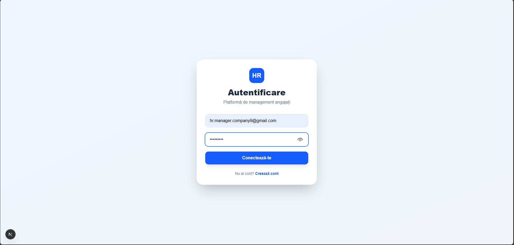 | Secure entry point for all organizational roles, utilizing JWT for session persistence. |
| **User Registration** | 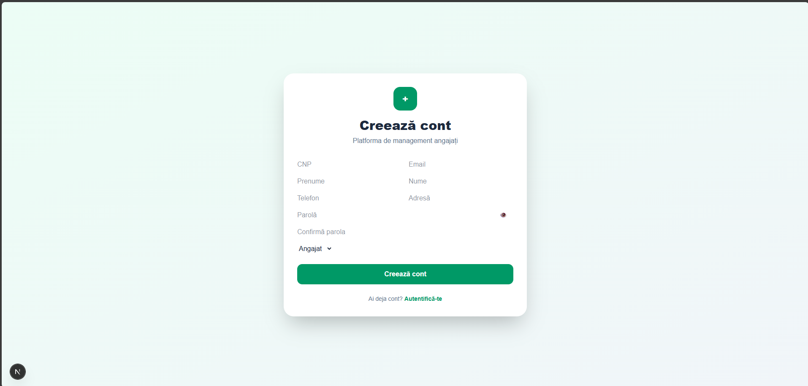 | A modern form allowing new users to join the platform with specific organizational roles. |
| **Two-Factor Auth** | 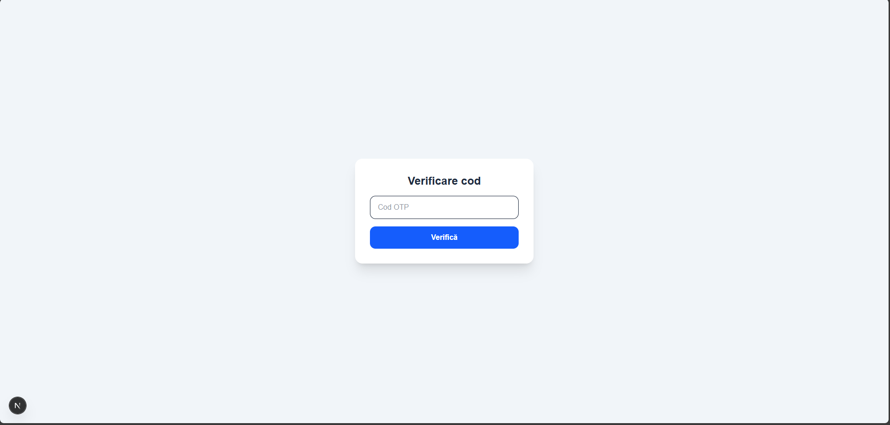 | Mandatory security layer for HR Managers, protecting sensitive data via unique OTP verification. |
| **Email Security** | 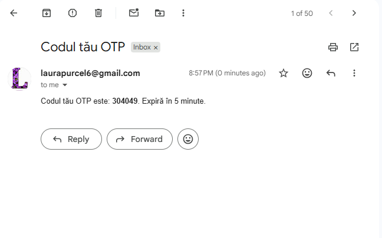 | Real-time integration with Java Mail Sender to deliver 2FA codes directly to the user's inbox. |

---

### 👤 Employee Experience & Financials
| Feature | Screenshot | Description |
| :--- | :---: | :--- |
| **Main Dashboard** | 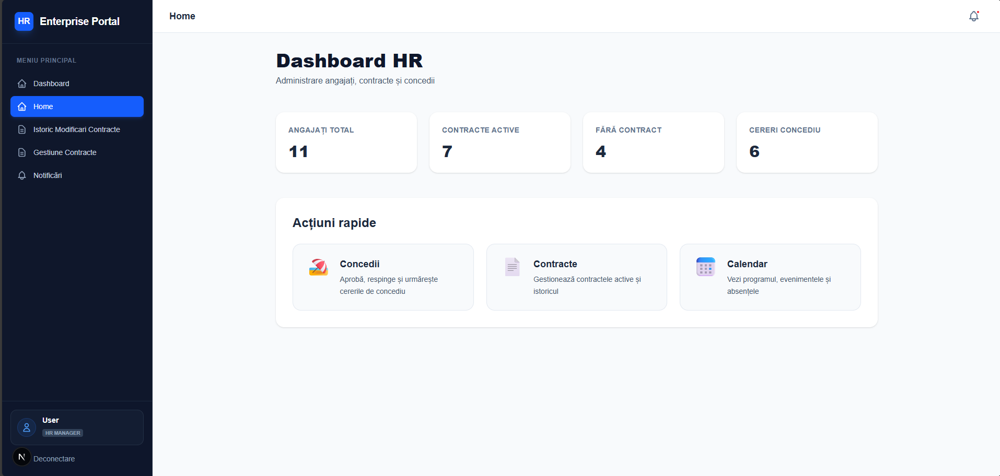 | Centralized control panel for managing employee contracts, leave approvals, and system-wide statistics. |
| **Personal Data** | 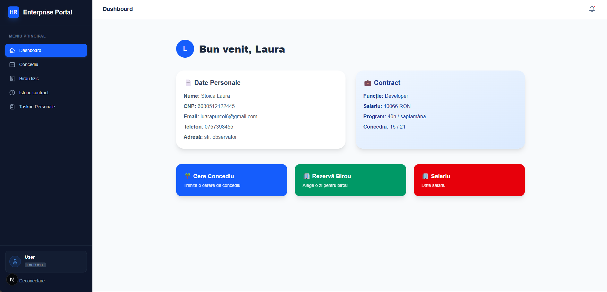 | Complete overview of the employee's profile, including contact details and address. |
| **Payroll View** | 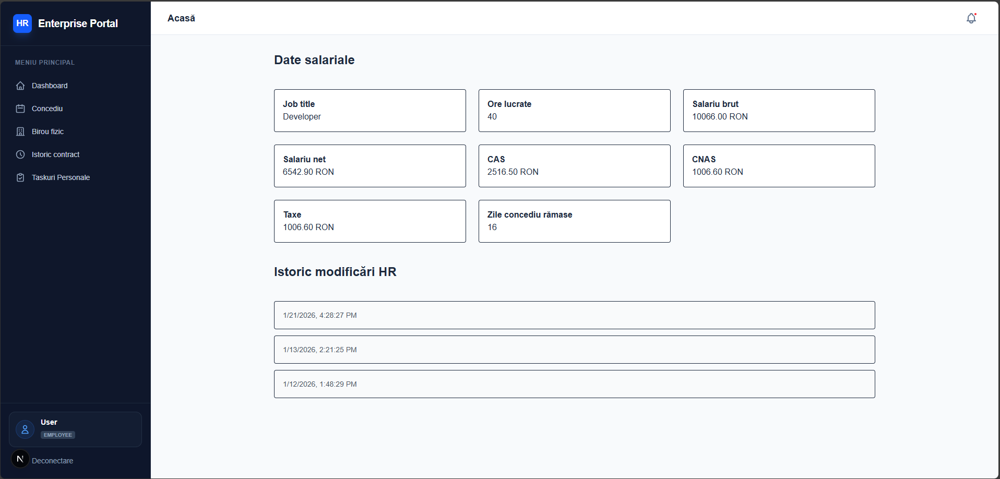 | Detailed salary breakdowns (Net/Gross) and tax contributions, calculated via **Strategy Pattern**. |
| **Leave Requests** | 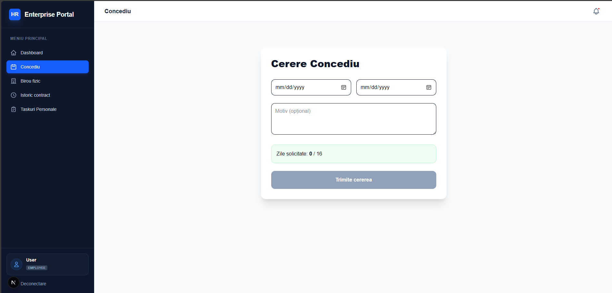 | Dedicated module for employees to submit and track their leave applications. |
| **Office Booking** | 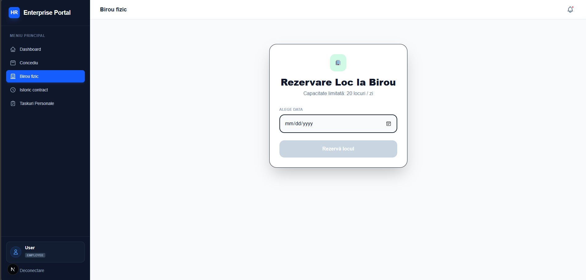 | Interactive tool for reserving physical office desks and managing workspace occupancy. |

---

### 👨‍💼 Task Orchestration (Manager)
| Feature | Screenshot | Description |
| :--- | :---: | :--- |
| **Task Creation** | 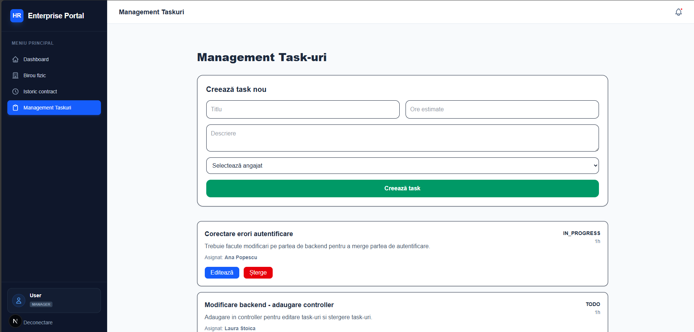 | Advanced form for assigning technical objectives to team members with estimated hours. |
| **Task Board** | 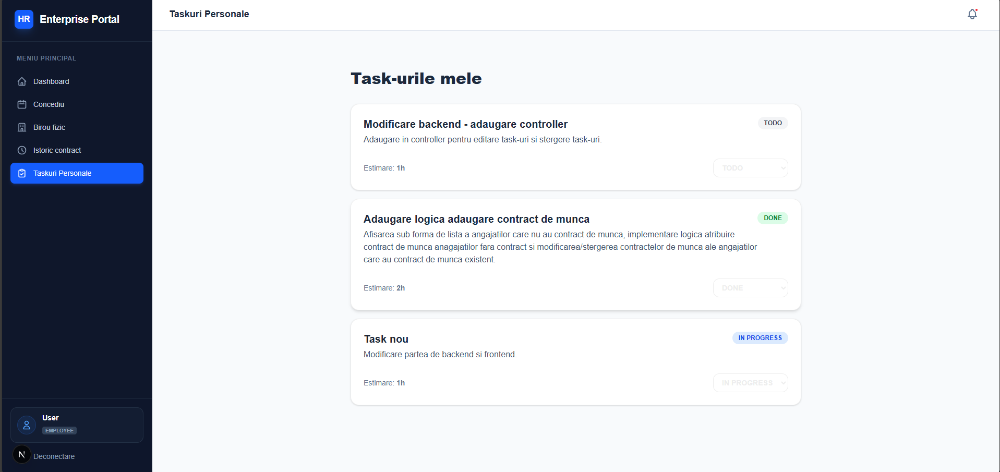 | Real-time tracking board displaying all active assignments categorized by status (TODO/IN PROGRESS/DONE). |

---

### ⚖️ HR Administration & Auditing
| Feature | Screenshot | Description |
| :--- | :---: | :--- |
| **Contract Audit** | 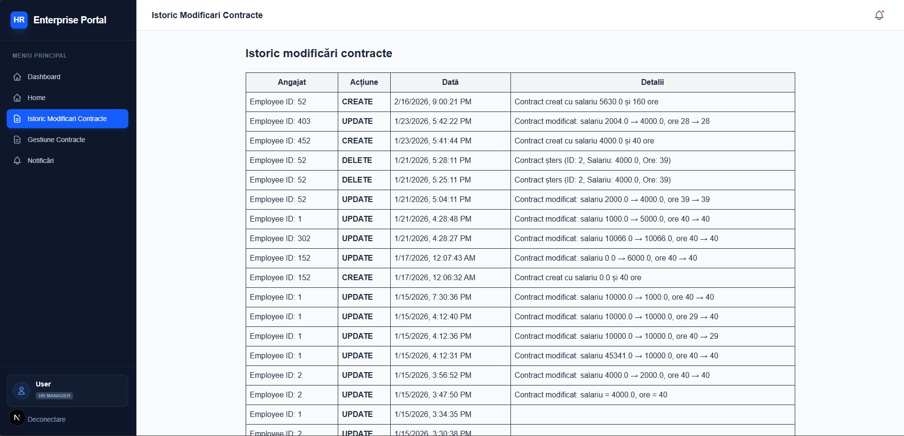 | Full history of contract modifications powered by the **Observer Pattern** for complete transparency. |
| **Auto-Notifications**| 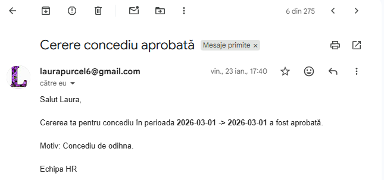 | Automated professional email alerts triggered instantly when HR processes a leave request. |
